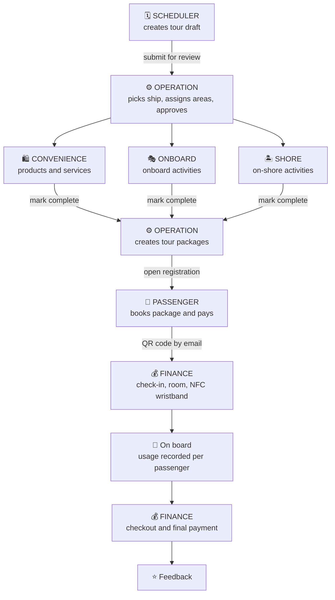
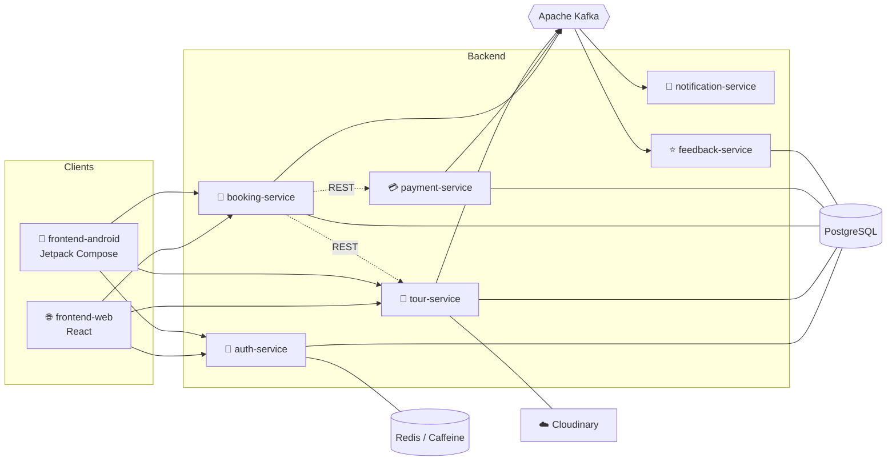

<div align="center">


<a href="https://git.io/typing-svg"></a>

<br/>


<br/>

[📖 Overview](#-overview) •
[👥 Roles](#-roles) •
[🔄 Workflow](#-core-workflow) •
[🏗️ Architecture](#%EF%B8%8F-architecture) •
[🧰 Tech Stack](#-tech-stack) •
[🚀 Getting Started](#-getting-started)

</div>

---

## 📖 Overview

A **microservice-based platform** that manages the entire lifecycle of a cruise tour, from planning and ship assignment to passenger booking, onboard activity tracking, and final checkout. It covers everything that exists and happens on the ship: rooms, NFC wristbands, products, services, activities, ports, and billing.

The system serves two groups of users:

| 🧳 Passengers                                                                | 🧑‍💼 Staff                                                                    |
| ---------------------------------------------------------------------------- | --------------------------------------------------------------------------- |
| Browse tour packages, book rooms, pay online, and receive a QR code by email | Manage ships, schedules, onboard offerings, check-in/check-out, and billing |
| 🌐 Website • 📱 Android app                                                  | 🌐 Website • 📱 Mobile app (simulating a POS device)                        |

### ✨ Key Features

- 🚢 **Ship management:** floors, floor zones, rooms, and room types
- 🗓️ **Tour planning** with a draft → submit → review → approve pipeline
- 🧭 **Assignment** of ship areas to products, services, and onboard activities, plus on-shore activities at each port
- 📦 **Tour packages** and online booking with capacity validation
- 🎫 **QR-code check-in**, room assignment, and **NFC wristband** identification
- 🧾 **Per-passenger billing:** every product, service, and activity used is recorded and settled at checkout
- 🔔 **Real-time notifications** and ⭐ feedback after each service or at the end of the trip

---

## 👥 Roles

|     | Role            | Responsibilities                                                                                                                                                                                                                                                                                        |
| :-: | --------------- | ------------------------------------------------------------------------------------------------------------------------------------------------------------------------------------------------------------------------------------------------------------------------------------------------------- |
| 🛡️  | **ADMIN**       | Manages private data and all accounts regardless of role. Manages ships (floors, zones, rooms, room types), NFC wristbands, product inventory, services, ports, and more.                                                                                                                               |
| 💰  | **FINANCE**     | Front desk and finance. Checks in passengers by scanning the booking QR code, assigns rooms, issues an NFC wristband to each passenger, and checks out passengers to settle the final invoice at the end of the trip.                                                                                   |
| 🗓️  | **SCHEDULER**   | Plans tours: the overall itinerary and the detailed schedule (daily plan and port stops, using ports created by ADMIN). Can only create and edit drafts. Once finished, submits the tour for review.                                                                                                    |
| ⚙️  | **OPERATION**   | Receives submitted tours, selects an available ship for the tour dates, chooses which categories the tour needs (and the ship supports), assigns ship areas to product, service, or activity, then approves to dispatch assignments. Later receives completed configurations and creates tour packages. |
| 🎭  | **ONBOARD**     | Pre-creates the catalog of **onboard activities**. When an assignment arrives, selects from the catalog and configures it, then marks it complete and returns it to OPERATION.                                                                                                                          |
| 🛍️  | **CONVENIENCE** | Pre-creates the catalog of **services** and **products** available on the ship. Handles assignments in the same way as ONBOARD.                                                                                                                                                                         |
| 🏝️  | **SHORE**       | Manages **on-shore activities**. Not assigned a ship area by OPERATION, but still receives an assignment when a tour is approved. Configures it directly (nothing is pre-created). Their slots are the **daily port arrival times**, not on-ship locations.                                             |
| 🧳  | **PASSENGER**   | Browses tour packages, books rooms, pays, and receives a QR code by email. Leaves feedback after using a service or at the end of the trip.                                                                                                                                                             |

### 🧩 Four Categories, Three Roles

The offerings on a tour fall into four categories, handled by exactly three roles:

| Category            | Icon | Handled by      |
| ------------------- | :--: | --------------- |
| Products            |  🛒  | **CONVENIENCE** |
| Services            |  💆  | **CONVENIENCE** |
| Onboard activities  |  🎭  | **ONBOARD**     |
| On-shore activities |  🏝️  | **SHORE**       |

These three roles also manage the data of passengers who have used or are using their offerings. Usage is recorded on the passenger's invoice for payment at checkout.

---

## 🔄 Core Workflow



<details>
<summary><b>📋 Step-by-step description</b></summary>

<br/>

1. **Planning.** SCHEDULER creates a tour draft with its itinerary, daily schedule, and port stops, then submits it for review.
2. **Review and assignment.** OPERATION picks a ship that is free during the tour dates, selects the categories the tour requires that the ship can support, and assigns each area to one of three types: product, service, or activity. Approving dispatches the assignments to the other roles.
3. **Configuration.** ONBOARD (activities) and CONVENIENCE (products and services) choose from their pre-created catalogs and assign items to the areas. SHORE configures on-shore activities directly, using port-arrival slots. Each marks their work as complete, which sends it back to OPERATION.
4. **Packaging.** OPERATION creates tour packages from the completed configurations. Each package is tied to **one room type** of the ship, then opens registration.
5. **Booking.** PASSENGER selects a package and number of rooms, enters passenger details, and pays.
6. **Check-in.** After successful payment, a QR code is emailed. FINANCE scans it to check in each passenger, assign rooms, and attach an NFC wristband.
7. **During the trip.** Every product, service, onboard activity, and on-shore activity used is attached to the passenger's invoice.
8. **Checkout.** FINANCE checks out the passenger and collects the final invoice.
9. **Feedback.** Passengers can rate each service or the whole trip.

</details>

---

## 📐 Business Rules

> [!IMPORTANT]
> **Booking capacity:** the number of passengers in a booking must be **less than or equal to** the room type's maximum occupancy × the number of rooms selected.

- 🚢 **Ship availability:** a ship can only be assigned to a tour if it is free during the tour dates.
- 📦 **Package and room type:** each tour package corresponds to exactly one room type.
- ✍️ **Draft vs. approved:** SCHEDULER can only create and edit drafts. Final approval belongs to OPERATION.
- 🏝️ **Shore slots:** SHORE slots represent port arrival times per day, not on-ship locations.
- 📱 **Identification:** each checked-in passenger is linked to an NFC wristband for identification and billing on board.

---

## 🏗️ Architecture

The backend follows a **microservice architecture**.



> The diagram above shows the main interactions. Adjust arrows to match your actual flows.

### 🧱 Services

| Service                     | Responsibility                                                                                                              |
| --------------------------- | --------------------------------------------------------------------------------------------------------------------------- |
| 🔐 **auth-service**         | Registration, login, and session management.                                                                                |
| 🚢 **tour-service**         | Core domain: ships, ports, schedules, assignments, catalogs, packages, NFC, inventory, onboard usage, and invoices.         |
| 📒 **booking-service**      | Passenger bookings and capacity validation.                                                                                 |
| 💳 **payment-service**      | Online payment and payment status handling.                                                                                 |
| 🔔 **notification-service** | Email (QR code delivery) and real-time notifications.                                                                       |
| ⭐ **feedback-service**     | Ratings and reviews after each service or at the end of the trip.                                                           |
| 📚 **common**               | Shared library: public geolocation API clients, Kafka events, Cloudinary file/image handling, and other reusable utilities. |

### 📡 Communication

| Type               | Purpose                                                                                                |
| ------------------ | ------------------------------------------------------------------------------------------------------ |
| **Kafka**          | Asynchronous messaging between producers and consumers in different services, to avoid tight coupling. |
| **REST over HTTP** | Service-to-service calls, configured with timeouts and retries.                                        |
| **RESTful API**    | Internal handling within a service and client-facing endpoints.                                        |
| **WebSocket**      | Real-time notifications, booking updates, and more.                                                    |
| **WebRTC**         | Internal communication through the browser over the LAN.                                               |

### 🔒 Security

- **JWT** authentication using Spring Boot's OAuth2 support (no custom filters)
- Role-based authorization for all roles listed above

---

## 🧰 Tech Stack

| Layer                     | Technology                   |
| ------------------------- | ---------------------------- |
| ⚙️ Backend                | Spring Boot                  |
| 🌐 Web frontend           | React, JavaScript, HTML, CSS |
| 📱 Mobile                 | Android, Jetpack Compose     |
| 📨 Messaging              | Apache Kafka                 |
| 🗄️ Database               | PostgreSQL (with ORM)        |
| ⚡ Cache / temporary data | Redis, Caffeine (e.g. OTP)   |
| ☁️ Media storage          | Cloudinary (images, video)   |
| 🔴 Real-time              | WebSocket, WebRTC            |
| 🔑 Auth                   | JWT, Spring Security OAuth2  |
| 🐳 Deployment             | Docker                       |

---

## 📂 Project Structure

```
.
├── backend/
│   ├── auth-service/
│   ├── tour-service/
│   ├── booking-service/
│   ├── payment-service/
│   ├── notification-service/
│   ├── feedback-service/
│   └── common/
├── frontend-web/          # React web app
├── frontend-android/      # Jetpack Compose Android app
├── docker-compose.yml
├── .env.example
├── .gitignore
└── README.md
```

---

## 🚀 Getting Started

### ✅ Prerequisites

- ☕ Java (JDK 17 or later recommended)
- 🔨 Maven or Gradle
- 🟢 Node.js and npm
- 🐳 Docker and Docker Compose
- 🤖 Android Studio (for the mobile app)

### 1️⃣ Clone the repository

```bash
git clone <your-repository-url>
cd <your-repository-folder>
cp .env.example .env   # then fill in your values
```

### 2️⃣ Start infrastructure

```bash
docker compose up -d
```

This starts the supporting services (PostgreSQL, Redis, Kafka, and so on). Adjust to match your `docker-compose.yml`.

### 3️⃣ Run the backend services

Run each service from its own directory:

```bash
cd backend/auth-service
./mvnw spring-boot:run
```

Repeat for `tour-service`, `booking-service`, `payment-service`, `notification-service`, and `feedback-service`.

### 4️⃣ Run the web app

```bash
cd frontend-web
npm install
npm start
```

### 5️⃣ Run the mobile app

Open the `frontend-android` folder in Android Studio, sync Gradle, and run it on an emulator or device.

---

## ⚙️ Configuration

<details>
<summary><b>🔧 Environment variables</b></summary>

<br/>

Copy `.env.example` to `.env` and set the following variables (names are examples; adjust to your setup):

| Variable                                                               | Description                  |
| ---------------------------------------------------------------------- | ---------------------------- |
| `DB_URL`, `DB_USERNAME`, `DB_PASSWORD`                                 | PostgreSQL connection        |
| `REDIS_HOST`, `REDIS_PORT`                                             | Redis connection             |
| `KAFKA_BOOTSTRAP_SERVERS`                                              | Kafka brokers                |
| `JWT_ISSUER_URI` / `JWT_SECRET`                                        | JWT / OAuth2 configuration   |
| `CLOUDINARY_CLOUD_NAME`, `CLOUDINARY_API_KEY`, `CLOUDINARY_API_SECRET` | Cloudinary credentials       |
| `MAIL_HOST`, `MAIL_USERNAME`, `MAIL_PASSWORD`                          | Email delivery for QR codes  |
| `PAYMENT_*`                                                            | Payment provider credentials |

> [!WARNING]
> Never commit secrets. Use a `.env` file or your secret manager and keep it out of version control.

</details>

---

## 🖼️ Screenshots

_Add screenshots or a demo link here._

---

## 🤝 Contributing

Contributions are welcome!

1. 🍴 Fork the repository
2. 🌿 Create a feature branch: `git checkout -b feature/your-feature`
3. 💾 Commit your changes: `git commit -m "Add your feature"`
4. 📤 Push the branch: `git push origin feature/your-feature`
5. 🔁 Open a Pull Request

---

## 📄 License

_Specify your license here (for example, MIT)._

---

## 📬 Contact

_Add author name, email, or links here._

<div align="center">


**⭐ If you find this project useful, give it a star! ⭐**

</div>
